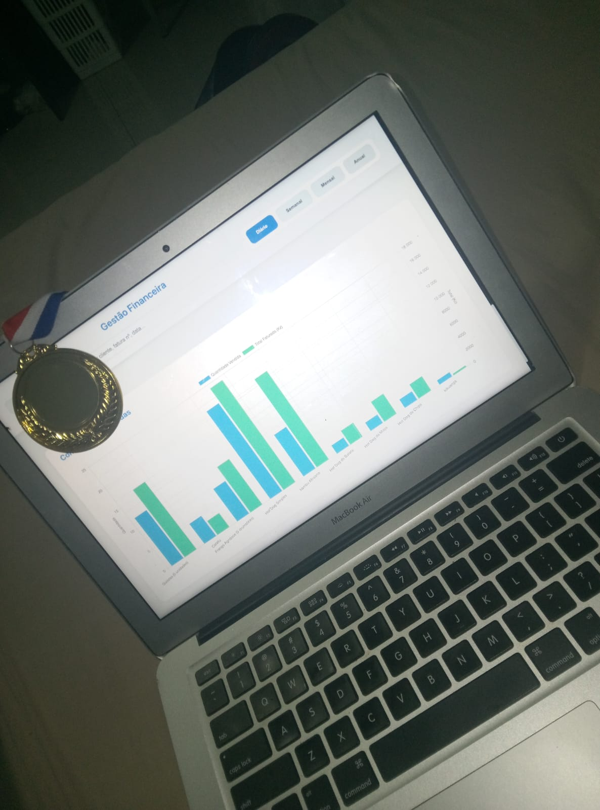

# ZeroBill

<p align="center">
	
</p>

[](LICENSE)

Aplicação desktop de gestão e faturação para pequenas empresas. O ZeroBill foi criado para substituir processos manuais por um fluxo local e simples de gestão de produtos, serviços, vendas, faturação e controlo operacional.

## Sobre o projeto

Pequenos negócios nem sempre dispõem de ferramentas adequadas para organizar produtos, registar vendas e acompanhar pagamentos. Quando estes processos são feitos manualmente, torna-se mais difícil manter a informação consistente e consultar os resultados da operação.

O ZeroBill foi desenvolvido como uma solução prática para esse contexto. A aplicação reúne num único ambiente a gestão de produtos e serviços, a configuração dos dados da empresa, a emissão de faturas e a consulta das vendas. Os dados são mantidos localmente, sem depender de uma conta ou de um servidor remoto.

## Problema e solução

### Problema

- Processos comerciais baseados em registos manuais.
- Informação de produtos, clientes e vendas dispersa.
- Dificuldade em acompanhar pagamentos, trocos e resultados por período.
- Necessidade de uma ferramenta acessível para uma pequena operação.

### Solução

O ZeroBill digitaliza o fluxo essencial da operação: os itens são registados no catálogo, os produtos ativos podem ser adicionados a uma fatura, o pagamento é validado e as vendas ficam disponíveis para consulta posterior. A aplicação foi desenhada para funcionar localmente e manter o fluxo de utilização direto.

## Principais funcionalidades

### Produtos e empresa

- Criar, editar, ativar, desativar e remover produtos ou serviços.
- Definir nome, tipo, preço e descrição.
- Pesquisar e filtrar itens por nome, tipo e estado.
- Registar nome, responsável, NIF, morada, telefones, email e descrição da empresa.

### Faturação

- Criar faturas com produtos e serviços ativos.
- Registar cliente e telefone opcional.
- Ajustar quantidades e remover itens.
- Calcular subtotal, total e troco.
- Registar valor recebido e método de pagamento.
- Validar pagamentos insuficientes e valores com vírgula decimal.

### Gestão financeira

- Consultar vendas por dia, semana, mês e ano.
- Pesquisar por cliente, número de fatura ou data.
- Consultar total faturado, número de faturas e item mais vendido.
- Visualizar um gráfico de quantidades vendidas e total faturado.
- Abrir os detalhes de cada fatura.
- Limpar os dados locais através de uma ação protegida por dupla confirmação.

## Aplicação em cenário real

O ZeroBill foi utilizado durante uma competição empresarial, num contexto em que eu estava na liderança da empresa. Antes da adoção do sistema, vários processos da operação eram realizados manualmente.

A solução própria permitiu apoiar a gestão da empresa e digitalizar parte desses processos. As empresas concorrentes trabalhavam essencialmente de forma manual e não utilizavam sistemas semelhantes. Nesse contexto, a inovação tecnológica e a adoção de uma ferramenta própria de gestão constituíram alguns dos diferenciais considerados na competição.

A empresa terminou a competição em **1.º lugar**. Este resultado é apresentado como o desfecho da competição, sem atribuir causalidade exclusiva ao ZeroBill.

<p align="center">
	
</p>

<p align="center">
	
</p>

## Demonstração

### Dashboard

<p align="center">
	
</p>

### Faturação

<p align="center">
	
</p>

### Gestão financeira

<p align="center">
	
</p>

> Os nomes atuais da pasta e de alguns ficheiros de imagem (`sreenshots`, `dasboard` e `managament`) são mantidos para corresponder à estrutura existente do repositório.

## Tecnologias

| Tecnologia         | Utilização                                             |
| ------------------ | ------------------------------------------------------ |
| Electron `28.3.3`  | Aplicação desktop e integração com o sistema operativo |
| JavaScript         | Lógica do processo principal e das interfaces          |
| HTML e CSS         | Estrutura e apresentação das telas                     |
| `electron-store`   | Persistência local de produtos, empresa e faturas      |
| Chart.js           | Gráfico de vendas, incluído localmente no renderer     |
| `electron-log`     | Registo de eventos do processo Electron                |
| `electron-updater` | Verificação e instalação de atualizações               |
| `electron-builder` | Empacotamento para macOS e Windows                     |

O projeto também inclui cópias locais de `html2canvas` e jsPDF no renderer. Atualmente, não são dependências npm diretas do projeto.

## Arquitetura

- **Main process:** [app/main/main.js](app/main/main.js) cria a janela Electron, gere o armazenamento local, valida dados recebidos por IPC e controla atualizações.
- **Preload:** [app/main/preload.js](app/main/preload.js) expõe uma API limitada ao renderer através de `contextBridge`.
- **Renderer:** cada área funcional tem a sua própria página, folha de estilos e lógica JavaScript.
- **Persistência:** `electron-store` guarda os dados no diretório local de utilizador definido pelo Electron.

O renderer é executado com `contextIsolation` ativo e `nodeIntegration` desativado. A comunicação entre os processos ocorre através dos handlers IPC expostos pelo preload.

## Estrutura do projeto

```text
ZeroBill/
├── app/
│   ├── main/
│   │   ├── main.js
│   │   └── preload.js
│   └── renderer/
│       ├── assets/
│       │   ├── libs/
│       │   ├── logos/
│       │   ├── sreenshots/
│       │   └── themeCSS/
│       ├── dashboard/
│       ├── invoice/
│       └── management/
├── LICENSE
├── README.md
├── package.json
└── package-lock.json
```

## Requisitos e estado de validação

- Node.js e npm.
- Um sistema operativo compatível com a versão de Electron instalada.

### Testado

- Aplicação executada em macOS 12.7.6 num Mac Intel.
- Build macOS gerado com targets DMG e ZIP.
- Sintaxe JavaScript validada nos módulos da aplicação.

### Ainda não confirmado

- Execução e instalação num Windows real.
- Ciclo completo de atualização através de uma release do GitHub.
- Execução e distribuição em Linux.

A versão exata de Node.js não está fixada no `package.json`. Recomenda-se uma versão LTS compatível com Electron `28.3.3` e com o npm instalado no ambiente.

## Instalação

```bash
git clone https://github.com/heldinesio-dev/ZeroBill.git
cd ZeroBill
npm install
```

## Execução

```bash
npm start
```

Para desenvolvimento, o projeto também disponibiliza:

```bash
npm run dev
```

Os dois scripts iniciam a aplicação Electron localmente.

## Build e produção

Para gerar os artefactos da plataforma configurada no ambiente atual:

```bash
npm run build
```

O `electron-builder` está configurado para:

- macOS: gerar DMG e ZIP com o ícone `.icns` configurado;
- Windows: gerar instalador NSIS `.exe` com o ícone `.ico` configurado.

O projeto não define atualmente um target Linux nem ARM64. O build Windows está configurado, mas ainda precisa de ser instalado e executado num Windows real antes de ser considerado validado.

Também existe o script:

```bash
npm run publish
```

Este comando tenta publicar builds macOS e Windows através do provider GitHub configurado no `package.json`. Requer uma release e credenciais de publicação adequadas.

## Dados e privacidade

Produtos, faturas e dados da empresa são armazenados localmente por `electron-store`, no diretório de dados do utilizador definido pelo Electron.

O projeto não implementa contas, autenticação, sincronização cloud ou uma base de dados partilhada entre dispositivos. Os dados locais devem ser incluídos numa estratégia própria de cópia de segurança.

## Segurança

As medidas atualmente implementadas incluem:

- `contextIsolation: true`;
- `nodeIntegration: false`;
- API de preload limitada através de `contextBridge`;
- validação dos dados recebidos por IPC antes da persistência;
- utilização de `path.join` para construir caminhos internos da aplicação.

Não são necessárias API keys ou credenciais externas para executar a aplicação localmente. O mecanismo de atualização depende de releases configuradas no GitHub.

## Estado atual e limitações

O ZeroBill encontra-se numa versão utilizável em evolução, adequada para demonstrar um fluxo local de gestão e faturação. As principais limitações conhecidas são:

- não existem testes automatizados no repositório;
- a compatibilidade Windows ainda não foi verificada numa máquina Windows real;
- o auto-update ainda não foi validado num ciclo completo de release;
- os instaladores não estão assinados no ambiente de desenvolvimento atual;
- não existe target Linux configurado.

## Contribuição

Contribuições são bem-vindas através de issues e pull requests. Antes de propor uma alteração:

1. Descreve o problema ou melhoria de forma objetiva.
2. Confirma que a alteração é compatível com a arquitetura Electron existente.
3. Testa localmente os fluxos afetados.
4. Inclui no pull request o contexto e a forma de validação.

## Autor

**Heldinêsio G. Cabaça**

O repositório está associado à conta GitHub `heldinesio-dev`.

## Licença

Este projeto está distribuído sob a licença **MIT**. Consulta o ficheiro [LICENSE](LICENSE).
