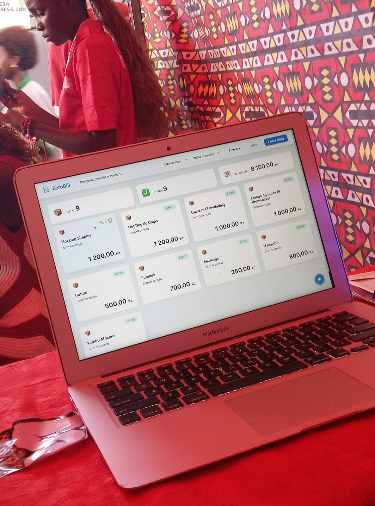
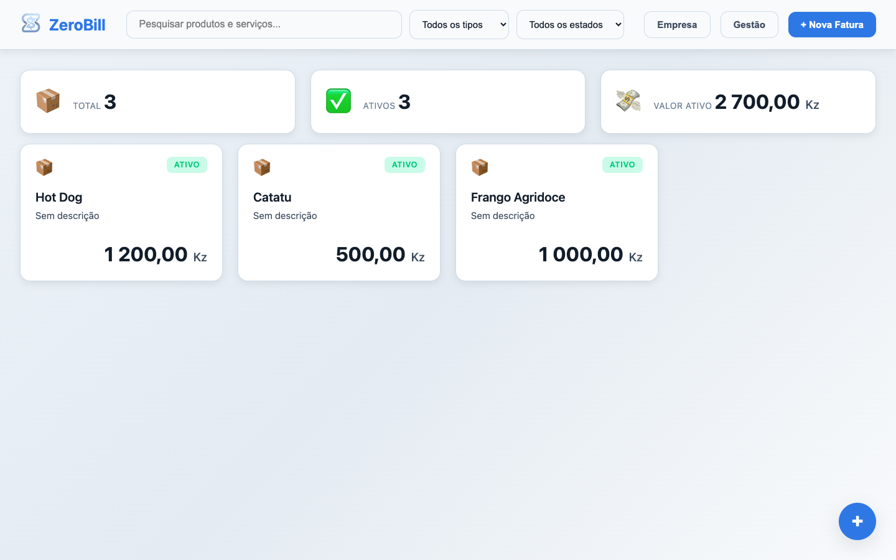
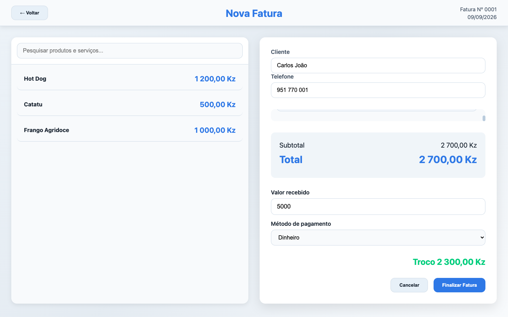

# ZeroBill


Aplicação desktop de gestão e faturação para pequenas empresas, construída com Electron e orientada para utilização local. O ZeroBill centraliza produtos, serviços, emissão de faturas, pagamentos, dados da empresa e consulta de vendas numa interface simples.

[](LICENSE)

## Sobre o projeto

O ZeroBill procura resolver uma necessidade prática de pequenas operações comerciais: manter os dados essenciais do negócio organizados e permitir registar vendas sem depender de um serviço remoto.

A aplicação foi desenvolvida para apoiar a gestão diária de produtos e serviços, a emissão de faturas e a consulta posterior dos resultados de vendas. A persistência é local e feita por computador, sem contas de utilizador ou sincronização cloud implementadas.

## Principais funcionalidades

### Gestão

- Criação e edição de produtos e serviços.
- Definição de preço, descrição e estado ativo/inativo.
- Pesquisa e filtragem por nome, tipo e estado.
- Configuração do perfil da empresa, incluindo nome, responsável, NIF, morada, telefones, email e descrição.

### Faturação

- Criação de faturas a partir dos produtos e serviços ativos.
- Identificação do cliente e telefone opcional.
- Alteração das quantidades dos itens.
- Cálculo de subtotal, total e troco.
- Registo do valor recebido e do método de pagamento.
- Validação de pagamentos insuficientes e de valores monetários com vírgula decimal.

### Gestão financeira

- Consulta de vendas por período diário, semanal, mensal e anual.
- Pesquisa de vendas por cliente, número de fatura e data.
- Resumo do total faturado e do número de faturas.
- Identificação do item mais vendido.
- Gráfico de quantidades vendidas e total faturado.
- Consulta dos detalhes de cada fatura.

## Validação em Ambiente Real

Em **05/06/2026**, durante uma Feira de Empreendedorismo, o ZeroBill foi utilizado e testado num cenário real pela empresa **S.O.S — Sabores Orientes do Sul**, da área de restauração.

Durante a experiência, o sistema auxiliou a gestão da operação, da contabilidade e da permanência dos dados dos clientes. No resultado do evento, a empresa conquistou o primeiro lugar. Este registo demonstra uma utilização prática do sistema estabelecendo uma relação causal entre o uso do ZeroBill e a classificação obtida.



## Screenshots

### Dashboard



### Gestão financeira

### Faturação



## Tecnologias

- Electron `28.3.3`.
- JavaScript.
- HTML e CSS.
- `electron-store` para persistência local.
- Chart.js, incluído localmente em `app/renderer/assets/libs/chart.min.js`.
- `html2canvas` e jsPDF, incluídos localmente no renderer.
- `electron-updater` para o mecanismo de atualização.
- `electron-builder` para empacotamento e distribuição.

## Arquitetura

O projeto utiliza a arquitetura padrão de uma aplicação Electron:

- **Main process:** cria a janela, gere o armazenamento local, valida os dados e expõe os handlers IPC.
- **Preload:** disponibiliza uma API limitada através de `contextBridge`, com `nodeIntegration` desativado no renderer.
- **Renderer:** contém as páginas e a lógica de interface do dashboard, faturação e gestão financeira.
- **Persistência:** `electron-store` guarda produtos, dados da empresa e faturas localmente.

## Estrutura do projeto

```text
ZeroBill/
├── app/
│   ├── main/
│   │   ├── main.js
│   │   └── preload.js
│   └── renderer/
│       ├── assets/
│       │   ├── libs/
│       │   ├── logos/
│       │   ├── sreenshots/
│       │   └── themeCSS/
│       ├── dashboard/
│       ├── invoice/
│       └── management/
├── LICENSE
├── package.json
├── package-lock.json
└── README.md
```

## Requisitos

- Node.js e npm.
- Um sistema operativo suportado pelo Electron.

### Estado de validação

- **macOS:** aplicação executada e build macOS gerado no ambiente de desenvolvimento, num Mac Intel com macOS 12.7.6.
- **Windows:** a configuração NSIS e o empacotamento Windows x64 foram preparados, mas a aplicação e o instalador ainda não foram testados num Windows real.
- **Linux:** não foi testado nem existe um target Linux configurado no `package.json`.

A versão exata de Node.js não está fixada pelo projeto. Recomenda-se utilizar uma versão LTS compatível com as versões de Electron e npm instaladas localmente.

## Instalação

```bash
git clone https://github.com/heldinesio-dev/ZeroBill.git
cd ZeroBill
npm install
```

## Execução

```bash
npm start
```

O script `npm run dev` existe como alias para o mesmo comando Electron:

```bash
npm run dev
```

## Build

O script de build disponível é:

```bash
npm run build
```

O `electron-builder` está configurado para gerar:

- macOS: DMG e ZIP.
- Windows: instalador NSIS `.exe`.

O target Windows x64 pode ser solicitado a partir de um ambiente compatível com o electron-builder, mas o instalador deve ser testado numa máquina Windows antes de ser apresentado como release verificada. O projeto não define atualmente um target Linux nem ARM64.

O script `npm run publish` também existe para publicação Windows/macOS através do provider GitHub. A publicação requer releases e credenciais adequadas; não é necessária para executar o projeto localmente.

## Dados e privacidade

Os produtos, as faturas e os dados da empresa são armazenados localmente por `electron-store`, no diretório de dados do utilizador definido pelo Electron para o sistema operativo em uso.

O projeto não implementa, atualmente:

- contas ou autenticação;
- sincronização cloud;
- servidor remoto;
- base de dados partilhada entre dispositivos.

Os dados locais devem ser tratados como informação do utilizador e incluídos numa estratégia própria de cópia de segurança.

## Segurança

O renderer utiliza `contextIsolation: true` e `nodeIntegration: false`. A comunicação com o processo principal é exposta através de uma API limitada no preload, e os dados recebidos por IPC são validados antes de serem persistidos.

Não são necessárias API keys ou credenciais externas para instalar e executar a aplicação localmente. O auto-update depende de releases configuradas no GitHub quando essa funcionalidade for utilizada.

## Limitações conhecidas

- Não existem testes automatizados no repositório.
- A compatibilidade Windows ainda não foi verificada através da execução numa máquina Windows real.
- O auto-update e a publicação de releases ainda precisam de ser testados num ciclo real de atualização.
- Os instaladores publicados não estão assinados no ambiente atualmente utilizado.

## Autor

**Heldinêsio G. Cabaça**

## Licença

Este projeto está distribuído sob a licença **MIT**. Consulte [LICENSE](LICENSE).
